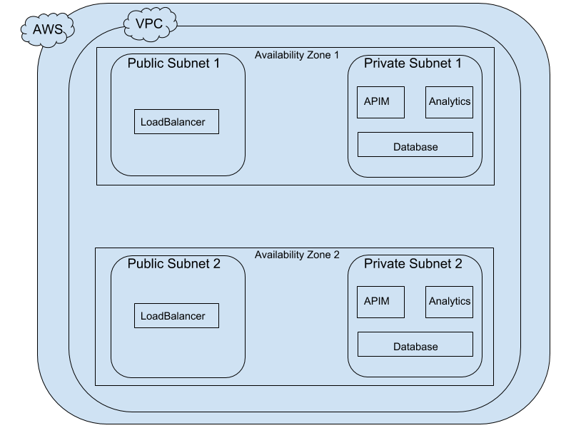

# WSO2 API Manager deployment with WSO2 API Manager Analytics

The WSO2 API Manager and API Manager Analytics AWS AMIs are created and available publicly.
They include the JDK, product distributions and a collection of utility libraries.

The Cloudformation template creates the following resources in AWS.

1. A Virtual Private Cloud (VPC)
2. Two Public Subnets
3. Two Private Subnets
4. An Elastic Load Balancer
5. An Internet Gateway
6. A Bastion Instance
7. RDS Database Instance
8. An Elastic File System

