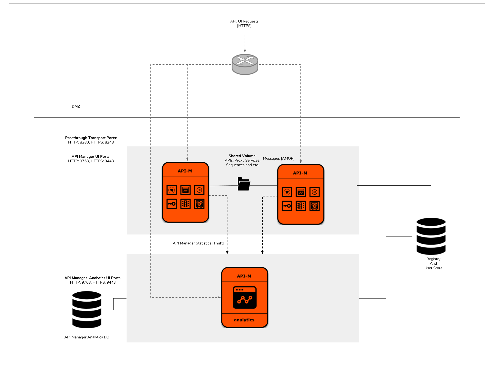

# AWS Resources for WSO2 API Manager

This repository contains CloudFormation templates to deploy WSO2 API Manager with different patterns in Amazon Web Services(AWS).

The WSO2 APIM CloudFormation templates use Puppet to manage the server configurations and use the following AMI's to provision the deployment.

1. Puppetmaster AMI - Contains the API Manager GA distribution, WSO2 Update Manager and Puppet modules containing the configurations for APIM deployment patterns.

2. APIM AMI - Contains the scripts that is required to create the Puppet catalog.

3. APIM-Analytics AMI - Contains the scripts that is required to create the Puppet catalog.

First the Puppetmaster AMI would deploy and afterwards the product specific AMI's would deploy and request the necessary configurations from the Puppetmaster AMI to deploy the WSO2 API Manager.

## Pattern 1

