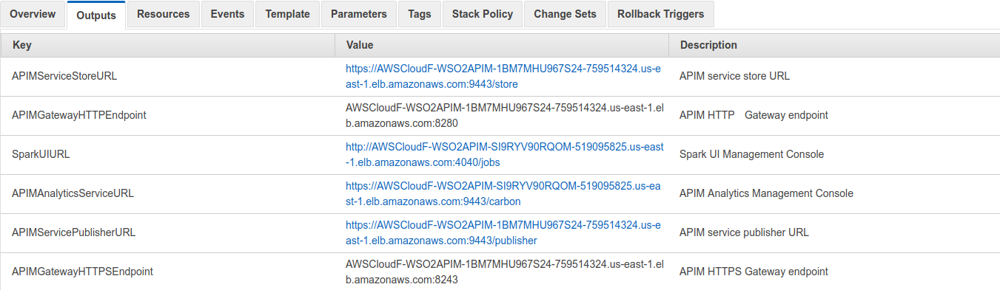

# AWS Resources for WSO2 API Manager

This repository contains CloudFormation templates to deploy WSO2 API Manager with different profile combinations in Amazon Web Services(AWS).

## Quick Start Guide

1. Checkout this repository into your local machine using the following Git command.
```
git clone https://github.com/wso2/aws-apim.git
```

2. Go to [AWS console](https://console.aws.amazon.com/ec2/v2/home#KeyPairs:sort=keyName) and create a key value pair in **us-east-1** region. This will be used to ssh into the instances.

3. Add a Server Certificate to AWS using ACM or IAM as explained [here](https://docs.aws.amazon.com/IAM/latest/UserGuide/id_credentials_server-certs.html).

4. Go to [AWS CloudFormation console](https://console.aws.amazon.com/cloudformation/home) and select ``Launch Cloudformer``.

5. Browse to the cloned repository and select the Cloudformation template for the preferred deployment pattern and proceed with the deployment.
    <br> Allowed patterns are [APIM-with-Analytics](https://github.com/wso2/aws-apim/tree/master/APIM-with-Analytics).
6. Follow the on screen instructions and provide the SSH key given in step 2, Server-Certificate-Name given in step 3 and other requested information and proceed.

7. Access the web UIs via the URLs available in the **Outputs** tab and login using the following credentials.
   * Username: admin <br>
   * Password: admin



**NOTE:** The services available through above URLs may take a around 10 minutes to become available, after stack creation.
