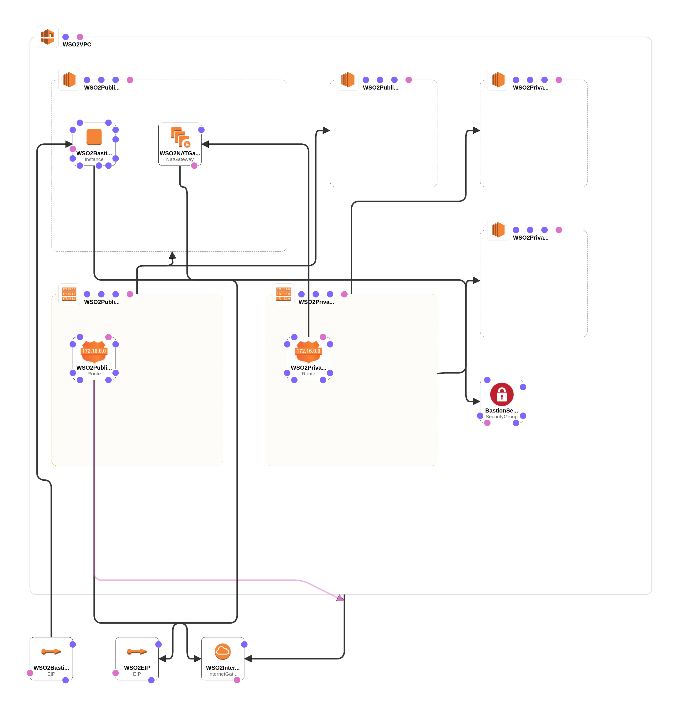

# WSO2 API Manager deployment with WSO2 Micro Integrator - Network

This is the phase one of deploying WSO2 API Manager deployment with WSO2 Micro Integrator. Use the [network.yaml](network.yaml) to create the required network. If you already have a preconfigured network, please proceed to [Phase 2](../database/README.md).

## Design Overview



### Estimated Cost

```
$8.50 per month
```
The above cost is calculated upon the usage of default parameters given in the [network.yaml](network.yaml). If different inputs are chosen at the runtime, the cost may differ from the above.

### Things to note

- We recommend you to keep the Bastion Instance in the `Stop` status after the deployment. The Bastion instance can be started whenever it is required to log into the Product Instances.

- Update the CIDR blocks of the [network.yaml](network.yaml) as required to limit the traffic to your network.

- The `InternetGateway` is used by the [pattern-1.yaml](../product/pattern-1.yaml) to get the latest [WSO2 updates](https://wso2.com/updates/).
