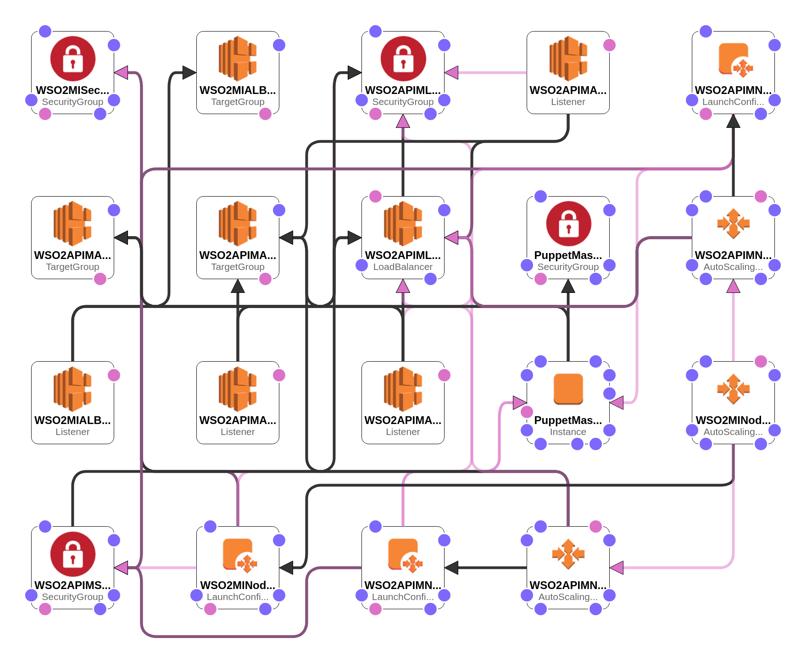

# WSO2 API Manager deployment with WSO2 API Manager Analytics - Product Deployment

This is the final phase of deploying WSO2 Identity Server HA deployment. Use the [identity.yaml](identity.yaml) to set up the deployment.


## Design Overview



The WSO2 API Manager CloudFormation templates use Puppet to manage the server configurations and use the following AMIs to provision the deployment.

1. Puppet master AMI - Contains the WSO2 API Manager Generally Available(GA) distribution, WSO2 API Manager Analytics Generally Available(GA) distribution, WSO2 Update Manager, and Puppet modules containing the configurations for API Manager deployment patterns.

2. IS AMI - Contains the scripts that are required to create the Puppet catalog. Additionally, these AMIs contain the OS hardening recommended by WSO2. When EC2 instances start using the AMIs, the instances are updated to get the latest OS updates.

### Order of execution

1. Puppet master
     - The latest OS updates and the required tools such as AWS CLI, Logstash, JDK are installed in the Puppet master.
     - The scripts needed to add the latest updates to the WSO2 products are retrieved.
     - The latest updates for WSO2 servers are added to the residing GA WSO2 servers in the AMI.
     - Relevant configurations(IP addresses, DB URLs, etc.) are done to the puppet modules.
     - DB scripts are executed against the DB created in [Phase 2](../database/README.md).

2. API Manager Analytics - Dashboard (Puppet agent)
   - The latest OS updates and the required tools such as puppet agent, AWS CLI, Logstash, JDK are installed in the puppet agent.
   - Puppet modules are retrieved from the Puppet master and the product is installed.
   - The directories should be persisted and mounted to an Elastic File System(EFS).
   - WSO2 servers are started.

3. API Manager Analytics - Worker (Puppet agent)
    - The latest OS updates and the required tools such as puppet agent, AWS CLI, Logstash, JDK are installed in the puppet agent.
    - Puppet modules are retrieved from the Puppet master and the product is installed.
    - The directories should be persisted and mounted to an Elastic File System(EFS).
    - WSO2 servers are started.

4. API Manager (Puppet agent)
     - The latest OS updates and the required tools such as puppet agent, AWS CLI, Logstash, JDK are installed in the puppet agent.
     - Puppet modules are retrieved from the Puppet master and the product is installed.
     - The directories should be persisted and mounted to an Elastic File System(EFS).
     - WSO2 servers are started.

### Estimated Cost

```
$169.86 per month
```
The above cost is calculated upon the usage of default parameters given in the [pattern-1.yaml](pattern-1.yaml). If different inputs are chosen at the runtime, the cost may differ from the above.

## WSO2 API Manager deployment with WSO2 API Manager Analytics


## Customizations

`WSO2ISEFSFileSystem` contains the bare minimum configurations to run an EFS. In a production system, the following values should be configured based on the requirements.

### File system encryption

Replace the EFS configurations in the CloudFormation if you need the File System to be encrypted.

#### [Encrypted:](https://docs.aws.amazon.com/AWSCloudFormation/latest/UserGuide/aws-resource-efs-filesystem.html)

> A Boolean value that, if true, creates an encrypted file system.

#### [KmsKeyId:](https://docs.aws.amazon.com/AWSCloudFormation/latest/UserGuide/aws-resource-efs-filesystem.html)

> The ID of the AWS KMS customer master key (CMK) to be used to protect the encrypted file system. This parameter is only required if you want to use a nondefault CMK. If this parameter is not specified, the default CMK for Amazon EFS is used. If KmsKeyId is specified, the Encrypted parameter must be set to true.

```yaml
WSO2APIMEFSFileSystem:
  Type: 'AWS::EFS::FileSystem'
  Properties:
    PerformanceMode: generalPurpose
    Encrypted: true
    KmsKeyId: !Ref KmsKeyId
```

### File system throughput

Replace the EFS configurations in the CloudFormation if you need to change the throughput configurations.

#### [ThroughputMode:](https://docs.aws.amazon.com/AWSCloudFormation/latest/UserGuide/aws-resource-efs-filesystem.html)

> The throughput mode for the file system to be created. There are two throughput modes to choose from for your file system: bursting and provisioned. If you set ThroughputMode to provisioned, you must also set a value for ProvisionedThroughPutInMibps. You can decrease your file system's throughput in Provisioned Throughput mode or change between the throughput modes as long as it’s been more than 24 hours since the last decrease or throughput mode change

#### [ProvisionedThroughPutInMibps:](https://docs.aws.amazon.com/AWSCloudFormation/latest/UserGuide/aws-resource-efs-filesystem.html)

> The throughput, measured in MiB/s, that you want to provision for a file system that you're creating. Valid values are 1-1024. Required if ThroughputMode is set to provisioned. The upper limit for throughput is 1024 MiB/s.

```yaml
WSO2APIMEFSFileSystem:
  Type: 'AWS::EFS::FileSystem'
  Properties:
    PerformanceMode: generalPurpose
    ThroughputMode: provisioned
    ProvisionedThroughPutInMibps: 2.0
```

## Things to note

- Update the CIDR blocks of the [pattern-1.yaml](pattern-1.yaml) as required to limit the traffic to/in your deployment as required.
